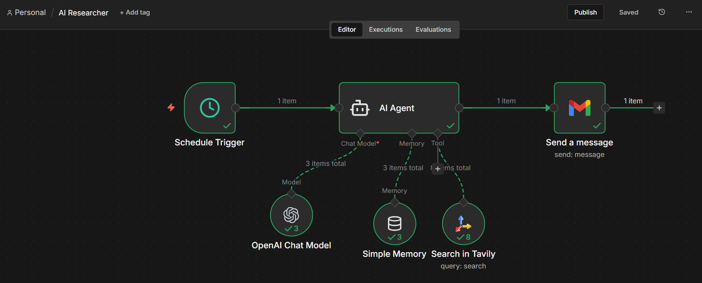
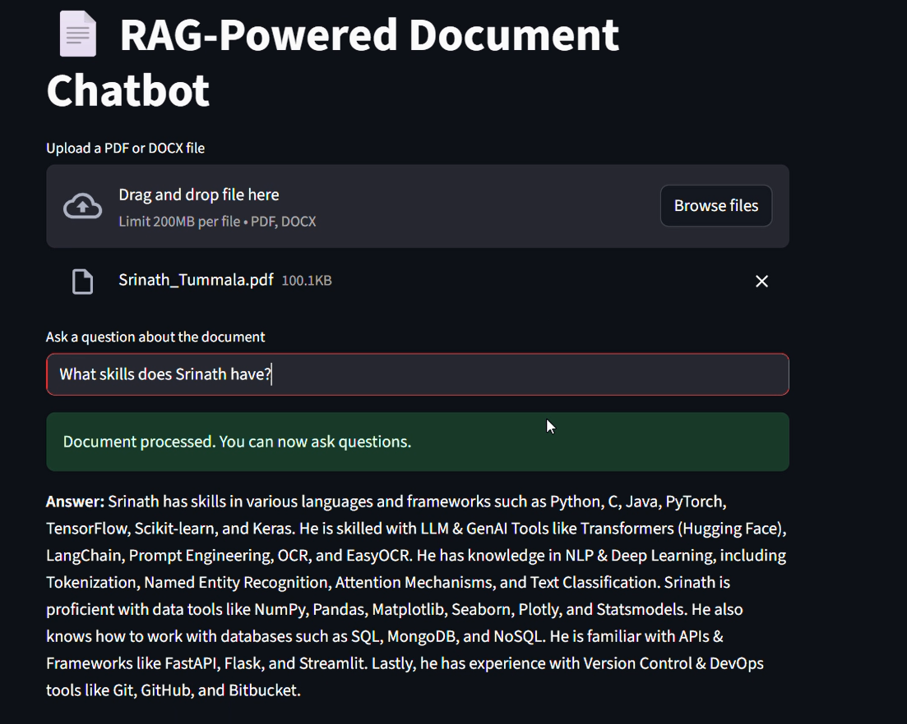

# My Projects
## Autonomous AI Technical Researcher Agent 
> Developed an autonomous **AI Research Agent** that monitors and aggregates the latest technical breakthroughs in Agentic AI, Generative AI, Data Science, and MLOps.
> This project demonstrates the ability to build **Agentic Workflows** using **n8n** that go beyond simple automation by incorporating real-time web search, autonomous reasoning, and automated professional content distribution.

### 🔑 Key Highlights
- Orchestrated a multi-node **n8n workflow** triggered daily to fetch real-time industry updates.
- Integrated an **AI Agent** powered by **GPT-4o-mini** with autonomous tool-calling capabilities.
- Utilized the **Tavily Search API** for deep, LLM-optimized web searching to ensure factual accuracy of recent events.
- Implemented **Simple Memory (Window Buffer)** to maintain context during the agent's reasoning process.
- Automated a dual-output pipeline: a detailed **Technical Research Report** sent via Gmail and a ready-to-publish **LinkedIn Post Draft**.

### 💬 Sample Output
- **Agentic AI:** Researched NVIDIA's Nemotron 3 open reasoning models and enterprise applications at CES 2026.
- **Generative AI:** Tracked the launch of Gemini 3 Flash and DeepMind's GenCast for weather forecasting.
- **LinkedIn Content:** Generated high-engagement drafts explaining GPU-level optimizations and multi-cloud MLOps orchestration.

### 🧰 Tech Stack
`n8n`, `OpenAI GPT-4o-mini`, `Tavily AI`, `Gmail API`, `JSON`, `Agentic Workflows`, `Prompt Engineering`

### 🖼️ n8n Workflow Architecture

---- 

## RAG-Powered Resume QA Chatbot             
> Built a question-answering chatbot using **Retrieval-Augmented Generation (RAG)** that allows users to query a document in natural language — tested using my own resume.
> This project showcases practical skills in integrating **OpenAI GPT-4** with **FAISS-based semantic search** to build scalable and contextual document assistants.

### 🔑 Key Highlights
- Used `text-embedding-ada-002` to generate embeddings from chunked document sections.
- Applied **LangChain** for managing document chunking, vector storage, and prompt templates.
- Implemented a clean, interactive frontend using **Streamlit**, backed by a **FastAPI** backend.
- Optimized prompt design to improve relevance and reduce token consumption.

### 💬 Example Queries
- What skills does Srinath have?  
- Which project involved working with OpenAI and RAG?  
- What is the embedding model used in the project?  
- Why should a company hire Srinath as a Generative AI Engineer or Data Scientist?

### 🧰 Tech Stack
`Python`, `OpenAI GPT-4`, `LangChain`, `FAISS`, `Streamlit`, `FastAPI`, `PyMuPDF`, `text-embedding-ada-002`

### 🖼️ Streamlit Demo Screenshot

----

## Advanced Linear Regression                        
> A US-based housing company named Surprise Housing has decided to enter the Australian market. The company uses data analytics to purchase houses at a price below their actual values and flip them on at a higher price. For the same purpose, the company has collected a data set from the sale of houses in Australia. The data is provided in the CSV file below.
The company is looking at prospective properties to buy to enter the market. You are required to build a regression model using regularisation in order to predict the actual value of the prospective properties and decide whether to invest in them or not.
The company wants to know:
Which variables are significant in predicting the price of a house, and
How well those variables describe the price of a house.
Also, determine the optimal value of lambda for ridge and lasso regression.
#### Steps Involved:
* Importing modules, Reading the data
* Analyzing Numerical Features
* Outlier Treatement
* Correlation Analysis
* Missing value treatement
* Univariate , Bivariate Analysis
* Data Visualization
* Encoding Categorical Features
* Splitting data into Train and Test data
* Transformation of Target Variable
* Feature Scaling
* Primary Feature Selection using RFE
* Ridge Regression
* Lasso Regression
* Comparing model coefficients
* Model Evaluation
* Choosing the final model and most significant features.
  
----------------------------------------------------------------------------------------------------------------------------------------

## Linear Regression - Boom Bikes Dataset               
> This Project is based on the rental bikes data set from a company called Boom Bikes.
#### Work Flow
* Data Loading and Understanding
* Data Visualization
* Data Preparation - Split into test,train and Rescale
* Data Modelling
* Residual Analysis, Checking Assumptions of Linear Regression
* Prediction and Evaluation on the Test Dataset

---------------------------------------------------------------------
## EDA - Lending Club Case Study                                                   
> This case study is based on Lending Club Dataset. Based on the available data set, we are required to draw insights which help in categorizing a new customer.
> The objective of this case study is to analyze the data to identify customers who might default the loan. 
#### Table of Contents
* Data Cleaning
* Data Standardization
* Missing value treatment
* Outliers Check
* Univariate Analysis and Segmented Univariate Analysis
* Observations from Univariate and Segmented Univariate Analysis
* Bivariate or Multivariate Analysis
* Observations from Bivariate or Multivariate Analysis

-----------------------------------------------------------------------------------------------------------------------------------------------

## Malicious URL Detection                         
> The aim of this project is to classify a URL as a Malicious or Benign URL.
> Collected a public dataset that consists of 450176 rows and two classes of URLs: Malicious or Benign. Have extracted a total of 17 features which consist of Lexical features, count-based features, and two binary features.
> Trained the model on Adaboost and Random Forest classifiers and used the Voting Classifier ensembling method to get the optimum result among the two classifiers

#### Table of Contents
* Data Collection
* Pre Processing
* Balancing the dataset
* Split the Dataset into train, test, and validation
* Model Training
* Model Evaluation

> This Project submitted as a thesis at GITAM University, Hyderabad.

> Authors: Srinath Tummala, Shivani Donthi

------------------------------------------------------------------------------------------------------------------------------------------

